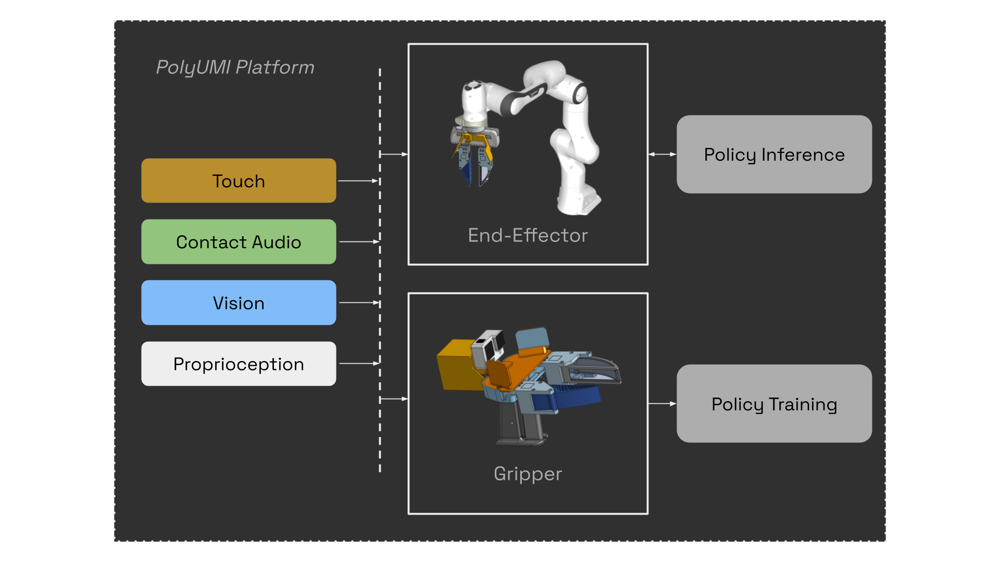

# PolyUMI: Visual + Auditory + Tactile Manipulation Platform for Imitation Learning

**Project website:** withheld for double-blind review<br>
**[Hardware build guide](https://docs.google.com/document/d/1HTwjLjrNoQFs5rB2DTdoAflJh1zYnw8AD4wD-CD382k/edit?usp=sharing)**

PolyUMI is an imitation learning platform supporting UMI-style data collection via a handheld gripper, which unifies the following sensor modalities in a single end-effector:
- **touch** (via a custom optical tactile-sensing finger, based on [PolyTouch](https://polytouch.alanz.info/)) - *10fps 540x480 MJPEG video (MP4)*
- **mechanical vibration** (via a contact microphone fixed to the finger housing) - *16kHz PCM audio (WAV)*
- **vision** (via GoPro camera on wrist + finger camera peripheral vision) - *60fps 1920x1080 MJPEG video (MP4) + 10fps 540x480 MJPEG video*
- **proprioception** (via monocular inertial SLAM from GoPro + IMU in gripper, or OptiTrack for the same, plus robot joint encoders + FK in embodiments)

It combines the [Universal Manipulation Interface (UMI)](https://umi-gripper.github.io/) platform with a custom touch-sensing finger inspired by the [PolyTouch tactile + audio sensor](https://polytouch.alanz.info/), with hardware, firmware, and software designed from scratch for modularity and hardware performance on a modern robotics stack (ROS2 Kilted/Humble, Python 3.13, Foxglove).

<div align="center" style="display: flex; flex-wrap: wrap; gap: 12px; justify-content: center;">
  <div style="flex: 1 1 480px; min-width: 320px; max-width: 600px;">
    
    <p style="margin: 6px 0 0; font-size: 0.9em; color: #666;">Data flow through the PolyUMI system.</p>
  </div>
  <div style="flex: 1 1 480px; min-width: 320px; max-width: 600px;">
    
    <p style="margin: 6px 0 0; font-size: 0.9em; color: #666;">General summary of software components in this repo.</p>
  </div>
</div>

## Repo Structure

```
catalog/          # Catalog UI: Web UI for organizing datasets collected on the gripper
docs/             # Documentation for this repo
external/         # Git submodules
  franka_gripper_control/   # FAULHABER gripper driver (CANopen CSP); runs on the NUC, speaks our
                            #   /polyumi/target_gripper contract unmodified
  franka_ros2/              # ROS2 control stack for Franka Emika Panda robot arm
  ORB_SLAM3_PolyUMI/        # PolyUMI's ORB_SLAM3 fork (monocular visual-inertial SLAM for the GoPro Hero 12)
  polyumi_diffusion_policy  # control policy implementations, dockerized & wrapped in an API server
inference_server/ # polyumi_inference: the inference wire protocol and both ends of it
                  #   (the ROS client imports it; so does the policy server. See docs/lab-fr3-inference.md)
infra/            # RPi provisioning infrastructure (see docs/pi-provisioning.md)
ingest/           # PC-side CLI: fetch sessions from Pi, run preprocessing pipeline, and export training datasets
notebooks/        # jupyter notebooks for bringup/debugging
nuc/              # inference pipeline code specific to our lab's Franka FR3 arm setup
pi/               # RPi app: streaming server for video + audio on the EE, gripper episode recording, etc
ros2_ws/
  src/
    polyumi_pi_msgs/   # Protobuf message definitions (camera frame, audio chunk)
    polyumi_ros2/      # ROS 2 nodes + Foxglove launch files
```

**Additional scripts:**
```
deploy.sh           # deploys code updates to the pi
fr3_session.sh      # brings up tmux sessions for inference on our lab's arm
serve_policy.sh     # brings up inference server for a trained model
setup_franka_env.sh # sets up PC-side environment for interacting with our lab's arm
train_policy.sh     # starts model training
```

## Prerequisites

**PC** (ingest, ROS 2 nodes, catalog): Ubuntu 24.04, Python 3.13, [uv](https://github.com/astral-sh/uv), ROS 2 Kilted, `ffmpeg`, `protobuf-compiler`, plus the ORB-SLAM3 build deps (`cmake`, `libopencv-dev`, `libeigen3-dev`, `libboost-serialization-dev`) — see [Installation](#installation) below.

**RPi** (gripper): Raspberry Pi Zero 2W flashed with Raspberry Pi OS, plus a GoPro Hero 12. See [docs/pi-provisioning.md](docs/pi-provisioning.md) for setup, and the hardware build guide linked above for instructions on building the data collection gripper + Franka end-effector.

**GPU workstation** (training + policy serving via [`train_policy.sh`](train_policy.sh) / [`serve_policy.sh`](serve_policy.sh)): our code has only been tested to run on
an NVIDIA RTX 6000 Ada GPU (48GB VRAM), but should run with at least 32GB. You need Docker with the NVIDIA container toolkit (ours runs rootless). Everything else lives in the image, so no host conda or CUDA toolkit is needed, nor is ROS. Optionally a [Weights & Biases](https://wandb.ai) API key for logging. See [docs/training-instructions.md](docs/training-instructions.md).

**Robot arm** (inference, optional): any arm you can drive from ROS 2. Ours is a Franka FR3 driven from a NUC running Ubuntu 22.04 / ROS 2 Humble and the Franka stack, talking to the PC over CycloneDDS; the arm-side code is in [nuc/](nuc/). See [docs/lab-fr3-inference.md](docs/lab-fr3-inference.md).

## Installation

### PC

Clone the repo and initialize the ORB-SLAM3 submodule (used by the SLAM
preprocessing step):

```bash
git clone git@github.com:anon-authors/PolyUMI.git
cd PolyUMI
git submodule update --init --recursive
```

> **Note for reviewers:** this repository has been anonymized for double-blind review. Our own
> forks — the ORB-SLAM3 fork, the policy forks, the OpenGoPro fork, and the impedance controller —
> are hosted under accounts that would identify the authors, so their URLs here are placeholders
> and will not resolve. `git submodule update` and `uv sync` will therefore fail until the
> camera-ready version restores them. Third-party upstreams (e.g. `frankarobotics/franka_ros2`)
> are unchanged and resolve normally.

Install ingest dependencies (includes the `polyumi_pi` package for shared data types):

```bash
uv sync --group dev
```

Install the inference protocol library for the ROS node's interpreter. `policy_client_node`
runs under `/usr/bin/python3`, not the uv venv, and imports `polyumi_inference` for the client
half of the protocol:

```bash
pip install --user --break-system-packages --no-deps -e inference_server/
```

`--no-deps` because numpy and requests arrive from apt via `rosdep` below; letting pip resolve
them would shadow the system numpy the rest of the ROS stack links against.

Build the ROS 2 workspace:

```bash
cd ros2_ws
rosdep install --from-paths src --ignore-src -r --rosdistro kilted
colcon build
source install/setup.bash
cd ..
```

Build the [ORB-SLAM3 fork](https://github.com/anon-authors/ORB_SLAM3_PolyUMI). First, install the system dependencies (Ubuntu;
the fork's [README.md](external/ORB_SLAM3_PolyUMI/README.md) has more detail):

```bash
sudo apt install libopencv-dev libeigen3-dev libboost-serialization-dev
```

Then run the build script (~15 minutes; also builds the nested Pangolin,
DBoW2, g2o, and Sophus submodules in-tree):

```bash
cd external/ORB_SLAM3_PolyUMI
bash build.sh
cd ../..
```

The ingest CLI then finds the binaries automatically — no env vars needed.
Set `ORB_SLAM3_DIR` and `ORB_SLAM3_BIN_SUBDIR` only if pointing at an
out-of-tree build.

### RPi

Follow the instructions in [docs/pi-provisioning.md](docs/pi-provisioning.md) to set up the pi for both gripper and end-effector.

After the setup instructions for the gripper above, the `polyumi-pi` systemd service will run every time the Pi boots, enabling you to record right away by pressing the button on the audio HAT.


## Recording on the Gripper
1. Turn on the GoPro attached to the UMI (until it's turned on, the Pi will not let you record)
2. Turn on the Pi using the small button on the side of the PiSugar battery unit (short press, then long hold until all 4 LEDs light up, then release)
3. Follow the [original UMI data collection instructions](https://swanky-sphere-ad1.notion.site/UMI-Data-Collection-Instruction-4db1a1f0f2aa4a2e84d9742720428b4c#Step-0) (Step 0) to scan the configuration QR code for the GoPro.
4. Wait until the red indicator LED on the audio HAT lights up red, indicating PolyUMI is ready to record. This may take 30-40 seconds after startup; the pi takes a while to boot.
5. Press the button on the audio HAT to start recording an episode; the LED will pulse and the GoPro will start recording; press the button again to stop recording. **Do not press the GoPro's shutter button or otherwise interact with the GoPro after powering it on; the pi will handle starting/stopping the GoPro's recording for synchronization.**

## Ingest

Data ingestion scripts that fetch recorded sessions from the Pi and pre-process them for use in training.
From the repo root:

```bash
uv sync --group dev
uv tool install --editable ingest
```

```bash
# Show all ingest commands:
pingest --help
# Fetch only the latest session from the Pi:
uv run pingest fetch --host <pi_ssh_hostname> --latest
# Fetch all new sessions:
uv run pingest fetch --host <pi_ssh_hostname>
# Plug in the GoPro's SD card before running the fetch commands above to automatically fetch the GoPro's footage for each session
# OR download gopro footage from the SD later for all sessions you've fetched:
pingest fetch-gopro --host <pi_ssh_hostname>

# PROCESSING SESSIONS ON DISK
# ingest all new scenes on disk into their pzarr form, skipping already-processed scenes:
pingest process-all
# run the preprocessing pipeline on a particular scene (time alignment, SLAM, etc)
pingest pp <scene_directory>
# export a single session to MCAP for easy visualization in foxglove (use the foxglove config
# in ingest/foxglove)
pingest export-mcap <scene_directory> <session_number>
# export a scene's EPISODE sessions to a UMI-format ReplayBuffer (.zarr.zip) for training:
pingest export <scene_directory> --output <output.zarr.zip>
```

The at-rest data format used during the preprocessing stage managed by `pingest` is a
zarr-based format stored in `scene.zarr` in each scene directory, referred to in these docs as `pzarr`. See [docs/data-format.md](docs/data-format.md) for details on the format & the rationale behind it. The GoPro camera calibration shared by SLAM and the ArUco gripper-width step is documented in [docs/camera-calibration.md](docs/camera-calibration.md).

## Data Management

Main article: [catalog/README.md](/catalog/README.md)

Collecting demonstration data, running preprocessing pipelines, and training models results in a bunch of files that can quickly
become confusing & disorganized on disk.
A lightweight web UI helps manage this data and keep it organized; hence the existence of the `polyumi-catalog` web tool.

It provides a GUI for managing episodes, scenes, tasks, and datasets, creating associations to keep your data organized, and providing
a convenient UI to access the ingestion scripts & foxglove viewer described above.

Run the server with: `uv run polyumi-catalog serve --recordings <path-to-your-recordings-dir>` to explore the UI.

## Training

Once a scene is preprocessed and exported (`pingest export`, above), train the visuomotor
diffusion policy in Docker on a GPU workstation. See
[docs/training-instructions.md](docs/training-instructions.md) for the build/run walkthrough,
the rootless-Docker notes, and how the trained policy is served back to the ROS inference node.

## Inference

### Streaming Demo

Streams camera, audio, and GoPro wrist camera into Foxglove.

On the Pi:

```bash
polyumi-pi stream
```

On the PC:

```bash
ros2 launch polyumi_ros2 stream_demo.launch.xml
```

Open [Foxglove](https://app.foxglove.dev), connect to `ws://localhost:8765`, and drag in `ros2_ws/src/polyumi_ros2/foxglove/layouts/stream_demo.json`.

The launch file accepts two arguments: `pi_host` (default `10.106.10.62`) and `video_device` (default `/dev/video2`) for the GoPro capture device.

### Running on a robot arm

First, see the [system calibration instructions](/docs/calibration-instructions.md) and update the values relevant to your setup.

`policy_client_node` drives a robot arm from a diffusion-policy inference server.
The arm's control stack typically runs on its own machine and is reached over ROS2;
how you bring that up, network the two machines, and configure DDS depends on your
robot and lab. The protocol — the wire format, the client, and the server app — is the `polyumi_inference` library in
[inference_server/](inference_server/).

[docs/lab-fr3-inference.md](docs/lab-fr3-inference.md) is a worked example for one
specific Franka FR3 setup that you can adapt.

## Hardware Notes

The Raspberry Pi app in `pi/` also depends upon a custom fork of [OpenGoPro](https://github.com/anon-authors/OpenGoPro) with some specific extra capabilities & one bugfix; without these the library cannot connect over BLE on Debian Trixie (and its downsteam RPi fork which we are using.)

### PiSugar Battery

Battery status is accessible at `http://<pi_ip>:8421` or via I2C:

```bash
sudo i2cdetect -y 1
sudo i2cget -y 0x57 0x2a   # battery percentage; 100% = 0x64, 50% = 0x32, etc.
```

### Troubleshooting the Pi

**`_version.py` missing on the Pi** — run `./deploy.sh <pi_ssh_hostname>` from the PC; this generates the file from the current git HEAD.

**Audio not detected** — confirm `wm8960-soundcard` appears in `arecord -l`. If the default RaspiAudio driver was previously installed, the Waveshare DKMS driver may need to be reinstalled after a kernel update.

**Wi-Fi not listing on the Pi** — run `sudo modprobe brcmfmac`, then retry `nmcli dev wifi connect "your-network"`.

**`protoc` not found during `polyumi_pi_msgs` install** — install `protobuf-compiler` (`sudo apt install protobuf-compiler` on the Pi, or via your system package manager on the PC).

**PiSugar 3 battery board won't turn off** - the `pisugar-server` service has probably crashed. SSH into the Pi and run `sudo systemctl restart pisugar-server` to fix it. You can also interactively communicate with the service with `nc -U /tmp/pisugar-server.sock`; then send `help` to show commands. This has worked for me in all my cases; if this doesn't work for you, check the PiSugar documentation for more ideas.

```bash
arecord -D hw:wm8960soundcard -r 48000 -f S16_LE -c 2 -d 5 test.wav
```

## Development

### Linting

Autofix everything fixable before you push — CI enforces it:

```bash
uv run ruff check --fix . && uv run ruff format .
```

Formatting is fully automatic; missing docstrings (`D1xx`) are not, and are left for you to write.

### Developing the polyumi-pi app

To deploy the latest code to the Pi, run from the PC:

```bash
./deploy.sh <pi_ssh_hostname>
```

Then on the Pi, install the Python environment and the `polyumi-pi` script:

```bash
cd ~/PolyUMI/pi
# venv should have already been created by cloud-init, but run this if you need to recreate it for any reason (e.g. to pull in new system packages like picamera2):
# uv venv --system-site-packages
uv sync --no-dev --extra pi
source .venv/bin/activate
```

The `pi` extra pulls in the Raspberry Pi hardware-only dependencies (`lgpio`, `gpiozero`, `rpi-hardware-pwm`) that the full app needs at runtime. They are gated behind this extra because `lgpio` can't build off-Pi (it needs `swig`), so a plain PC dev sync omits them. `deploy.sh` passes `--extra pi` automatically.

`picamera2` must be installed via `apt`, not pip — the `--system-site-packages` flag above pulls it in from the system.
(this apt install & others is handled by the `cloud-init` [provisioning](docs/pi-provisioning.md) workflow).

**Tip for development:** add the `deploy.sh` invocation to `.vscode/tasks.json` as a build task so it runs with Ctrl+Shift+B.

Run `polyumi-pi --help` for a full list of commands.

## Citation

This system was previously described in a workshop paper. The citation is **withheld for
double-blind review** and will be restored in the camera-ready version.

If you wish to cite the full tactile learning system (including models, datasets, inference
pipeline, etc), please note that this will be released in an upcoming work.

## Acknowledgments & Maintenance

Author and institutional affiliation details are **withheld for double-blind review**.
